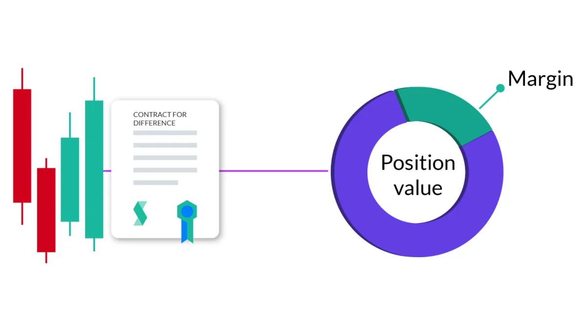
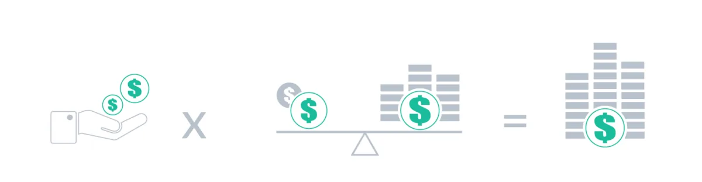
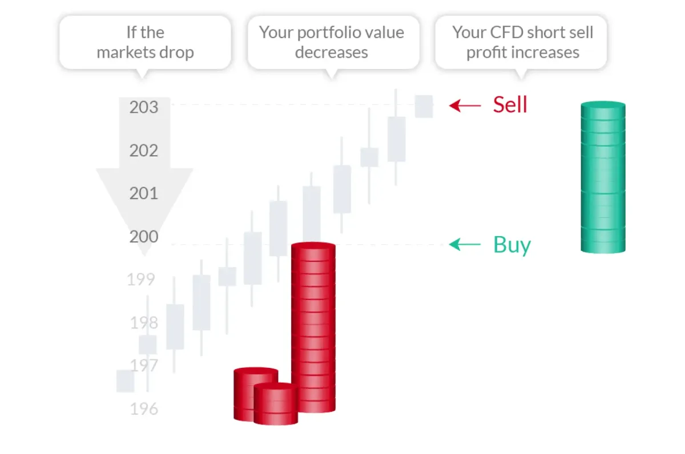
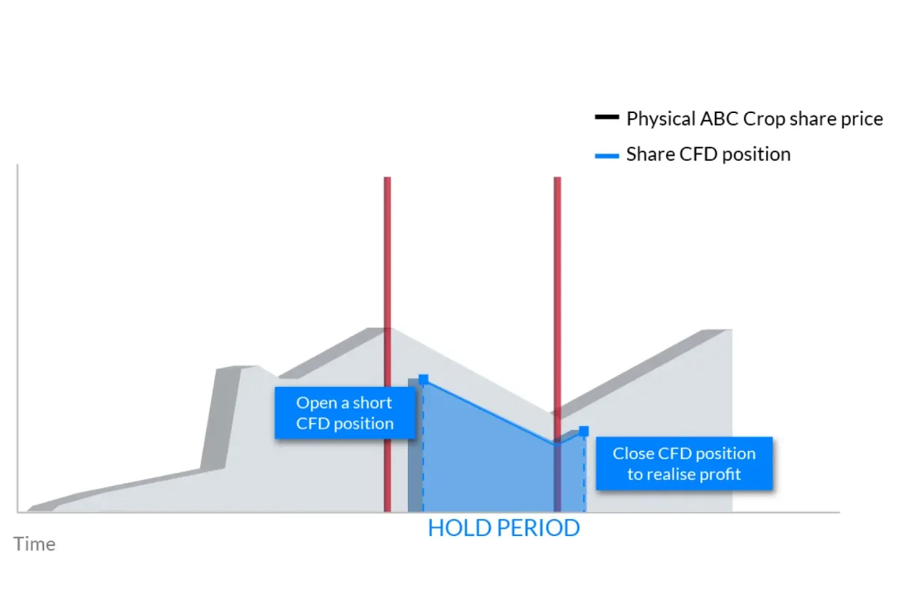

**差价合约 (CFD)**是一种*在无需买卖任何标的资产的情况下推测金融市场资产价格变动的方法。*

差价合约是为希望利用上涨和下跌市场的交易者而设计的，因为它让交易者有机会推测资产价格是上涨还是下跌 -_无需拥有资产本身！_

\***\*差价合约是如何运作的？\*\***

通过差价合约交易，您可以支付交易价值的一小部分。 这显着增强了您的购买力。 通过将您的原始投资乘以一个比率（杠杆），您可以控制比原始投资金额大得多的头寸。

例如，以 1,000 美元的投资和 1:30 的杠杆，可以买卖价值 30 倍的资产，即 1,000 美元 x 30 = 30,000 美元。

由于只需存入 CFD 交易总值的一定百分比，杠杆 CFD 合约提供的市场敞口正是此类交易如此吸引人的原因。 但了解相关风险也很重要：差价合约交易者在亏损交易中的风险敞口与在盈利交易中的风险敞口一样大。

\***\*保证金\*\***

**杠杆倍增你的投资额**，而**保证金是任何给定交易所需的投资额**。 这笔初始存款就是保证金。 因此，假设你想开一笔价值 120,000 美元的交易，并且该资产类别的杠杆率为 1:30，您所需的保证金（投资金额）将为 120,000 美元 / 30 = 4,000 美元。 这意味着您需要支付标的股票价值的一小部分来开仓，而不是支付标的股票的全部价值。

杠杆在 CFD 交易中提供的敞口会影响交易的盈利或亏损。 在下面的示例中，您将看到影响杠杆有两种方式。 损益的计算方法是查看差价合约买入或卖出的初始价格与交易退出时的价格差异（基于对特定市场条件下资产价格的推测）。

\***\*什么是卖空？\*\***

这与买入“多头”正好相反——唯一的显着区别是您预期股价会向哪个方向移动。空头头寸是做空市场，在价格下跌时获利，而多头头寸涉及购买资产 希望价格会上涨。

\***\*在下跌的市场中卖空差价合约\*\***

\***\*通过差价合约交易对冲您的实物投资组合\*\***

\***\*交易者偏爱差价合约的 3 个原因 / 差价合约交易的好处\*\***

- 它为投资者提供了拥有证券而无需实际拥有证券的所有好处和风险。
- 杠杆的使用允许投资者投入交易金额的一小部分。
- 投资者能够轻松地做多或做空头寸或买入和卖出头寸。

\***\*差价合约交易的成本是多少？\*\***

### **点差**

交易差价合约时，您需要支付点差，即买入价和卖出价之间的差额。 这是我们执行您的交易的费用。 如果您进入买入交易，您将使用报价的买入价并使用卖出价退出该交易，反之亦然。

价差越窄，在您开始获利之前价格对您有利的变动就越少； 或者，如果价格走势对您不利，则亏损。

\***\*隔夜利息（又名利息、隔夜利息或隔夜费用）\*\***

在每个交易日结束时（格林威治标准时间 21:59），您账户中的任何开立头寸都可能会收取称为掉期费的费用，该费用可能是正数或负数，具体取决于您的头寸方向和适用的 利率。
