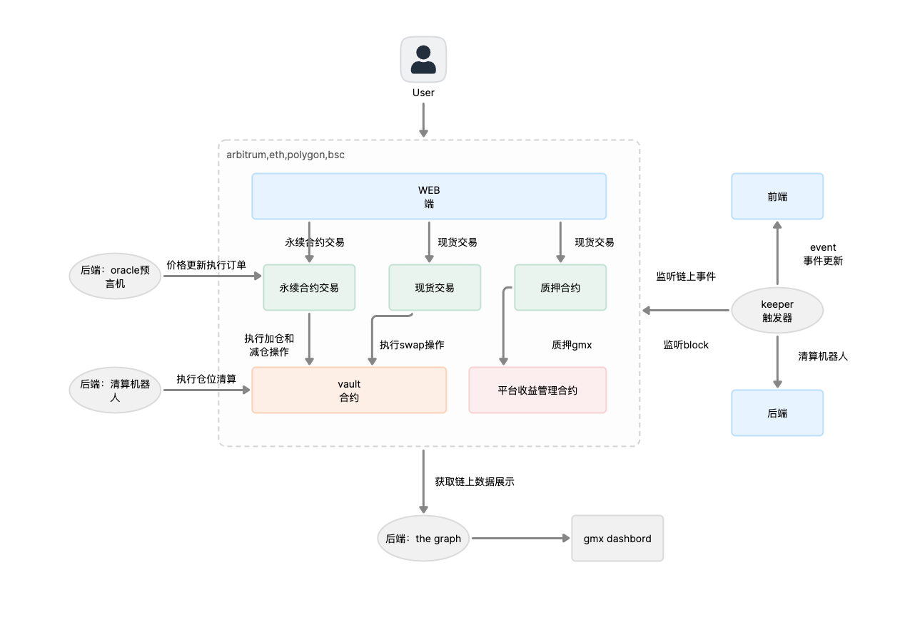
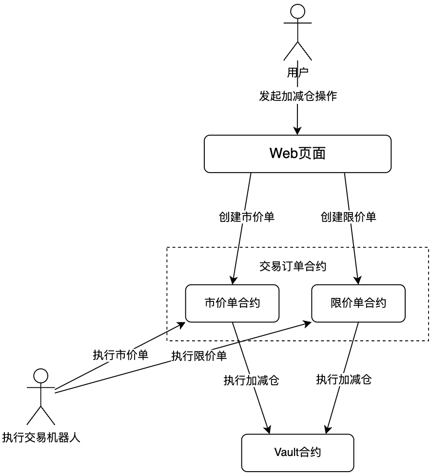

## gmx订单、仓位机制与实现


GMX系统设计框架，核心模块永续合约模块，现货交易，质押模块。





#### 系统模块架构

•Vault:deposit & 处理trading

•Routers:OrderBook

•PositionManager:为Vault处理token 转账 & warp/unwarp

•Price Feeds:处理报价keeper的提交

•GMX:治理ERC20代币 质押奖励

•GLP:流动性池中mint的LP代币

#### 订单数据模型：

``` solidity
{
	"id": keccak256(_account, _collateralToken, _indexToken, _isLong), // 仓位ID
	"size": uint256, // Position大小
	"collateral": uint256, // 抵押品价格 USD
	"averagePrice": uint256, // 平均持仓价格 USD
	"entryFundingRate": uint256, // 入场资金费率
	"reserveAmount": uint256, // 抵押品token储备数量
	"realisedPnl": int256, // 已兑付盈亏
	"lastIncreasedTime": uint256, // 最后加仓时间
}
```

订单类型: GMX提供了多种订单类型，如市场订单、限价订单、止损和止盈订单。这为交易者提供了灵活性，使他们能够更好地管理风险。


#### GMX加减仓业务逻辑

GMX加减仓业务流程：


**创建订单流程**

用户在Web页面发起市价或者限价单，并发送Transaction到链上。

Transaction会根据用户的提交参数，选择调用市价单或者限价单合约来创建订单。

结束，等待交易机器人执行交易。


**执行订单流程**

执行交易机器人根据市场价选择执行市价单或者限价单，并发送交易到链上。

Transaction会根据会根据机器人的提交参数，选择调用市价单或者限价单合约和执行订单。

市价单或者限价单合约会调用Vault合约来执行加减仓操作。

| 合约名称 | 合约地址 |
|-|-|  
| 市价单合约 | https://arbiscan.io/address/0xb87a436b93ffe9d75c5cfa7bacfff96430b09868 |
| 限价单合约 | https://arbiscan.io/address/0x09f77e8a13de9a35a7231028187e9fd5db8a2acb |
| Vault合约 | https://arbiscan.io/address/0x489ee077994b6658eafa855c308275ead8097c4a |

| 操作名称 | 交易Hash |
|-|-|
| 用户发起市价单加仓交易 | https://arbiscan.io/tx/0x3230e702a44c6029790d279d0a11e87f89474a9fec251aa0b7f5070aab38104b |  
| 用户发起市价单减仓交易 | https://arbiscan.io/tx/0x7d359cb6a1744f87c6b4cc1ff93a8b8ee9fc6bbfa73227e8c7d8b59214a8a368 |
| 执行机器人执行市价单 | https://arbiscan.io/tx/0x5f5a3a90ed30b099ad456f14e7ea580cea3f25cd4bdf2d491ae5e18eadd87ff2 |
| 执行机器人执行限价单 | https://arbiscan.io/tx/0x3cc5b3bd1fc5efeba0cbf1cfc5752773d9476c15b2fb8cc3bb5dc02b8480b5af |


#### 代码分析：

Router合约为Vault提供function。例如，负责transfer token to Vault，对原生token进行wrap等。

1. PositionRouter
仅针对市价单，处理increase和decrease多仓和空仓的前置操作。用户发出请求后，keeper向交易所聚合器请求指数价格。keeper以此执行头寸。如果无法在滑点内执行则会被回滚。
处理increase position


代码的结构梳理：

合约位置：contracts/position/IncreasePositionUtils.sol

- IncreasePositionUtils：增加仓位的工具库
- increasePosition：增加仓位的函数
- processCollateral：处理仓位的抵押品变化
- getExecutionPrice：获取执行价格的函数

``` Solidity
function createIncreasePosition(
        address[] memory _path, // 交易对
        address _indexToken,
        uint256 _amountIn, 
        uint256 _minOut,
        uint256 _sizeDelta,
        bool _isLong,
        uint256 _acceptablePrice,
        uint256 _executionFee,
        bytes32 _referralCode,
        address _callbackTarget
    ) external payable nonReentrant returns (bytes32) {
        // 执行费检查
        require(_executionFee >= minExecutionFee, "fee");
        require(msg.value == _executionFee, "val");
        // 判断资产转换
        require(_path.length == 1 || _path.length == 2, "len");

        _transferInETH();
        // 设置refCode
        _setTraderReferralCode(_referralCode);

        // 处理增加仓位的token
        if (_amountIn > 0) {
            IRouter(router).pluginTransfer(_path[0], msg.sender, address(this), _amountIn);
        }

        // 更新状态
    }
``` 

执行increase position

```  Solidity
function executeIncreasePosition(
    bytes32 _key, 
    address payable _executionFeeReceiver
    ) public nonReentrant returns (bool) {
        // 读取和校验Position Request
        IncreasePositionRequest memory request = increasePositionRequests[_key];
        if (request.account == address(0)) { return true; }

        // 基于position delay time和请求keeper验证
        bool shouldExecute = _validateExecution(request.blockNumber, request.blockTime, request.account);
        if (!shouldExecute) { return false; }

        // 更新状态
        delete increasePositionRequests[_key];

        // 资产转换
        if (request.amountIn > 0) {
            uint256 amountIn = request.amountIn;

            if (request.path.length > 1) {
                IERC20(request.path[0]).safeTransfer(vault, request.amountIn);
                amountIn = _swap(request.path, request.minOut, address(this));
            }

            uint256 afterFeeAmount = _collectFees(request.account, request.path, amountIn, request.indexToken, request.isLong, request.sizeDelta);
            IERC20(request.path[request.path.length - 1]).safeTransfer(vault, afterFeeAmount);
        }

        // 验证全局头寸
        _increasePosition(request.account, request.path[request.path.length - 1], request.indexToken, request.sizeDelta, request.isLong, request.acceptablePrice);

        // 处理执行费用
        _transferOutETHWithGasLimitFallbackToWeth(request.executionFee, _executionFeeReceiver);

        // event...

        // 回调
        _callRequestCallback(request.callbackTarget, _key, true, true);

        return true;
    }
``` 

处理decrease position

```  Solidity
    function executeDecreasePosition(
        bytes32 _key, 
        address payable _executionFeeReceiver
        ) public nonReentrant returns (bool) {
        // 读取和校验Request
        DecreasePositionRequest memory request = decreasePositionRequests[_key];
        if (request.account == address(0)) { return true; }

        // 基于position delay time和请求keeper验证
        bool shouldExecute = _validateExecution(request.blockNumber, request.blockTime, request.account);
        if (!shouldExecute) { return false; }

        // 更新状态
        delete decreasePositionRequests[_key];

        // 验证仓位价格，使用TimeLock更新全局空头，验证referral，执行减仓
        uint256 amountOut = _decreasePosition(request.account, request.path[0], request.indexToken, request.collateralDelta, request.sizeDelta, request.isLong, address(this), request.acceptablePrice);

        // 处理交易对
        if (amountOut > 0) {
            if (request.path.length > 1) {
                IERC20(request.path[0]).safeTransfer(vault, amountOut);
                amountOut = _swap(request.path, request.minOut, address(this));
            }

            if (request.withdrawETH) {
               _transferOutETHWithGasLimitFallbackToWeth(amountOut, payable(request.receiver));
            } else {
               IERC20(request.path[request.path.length - 1]).safeTransfer(request.receiver, amountOut);
            }
        }

       _transferOutETHWithGasLimitFallbackToWeth(request.executionFee, _executionFeeReceiver);

        // event ...

        _callRequestCallback(request.callbackTarget, _key, true, false);

        return true;
    }
``` 

2. OrderBook

CRUD increase,decrease,swap 订单簿

Order索引和结构

```  Solidity
// account => orderIndex => Order
mapping (address => mapping(uint256 => SwapOrder)) public swapOrders;
// account => index
mapping (address => uint256) public swapOrdersIndex;

struct IncreaseOrder {
    address account; // 创建订单账户
    address purchaseToken; // 用于增加仓位的token
    uint256 purchaseTokenAmount; // token数量
    address collateralToken; // 质押token
    address indexToken; // 标的token
    uint256 sizeDelta; // 增加仓位大小
    bool isLong; //多空仓
    uint256 triggerPrice; //限价
    bool triggerAboveThreshold;
    uint256 executionFee;
}

struct SwapOrder {
    address account; // 创建订单账户
    address[] path; //用于交易的token path
    uint256 amountIn;
    uint256 minOut; // 最小接受token数
    uint256 triggerRatio; // 限价
    bool triggerAboveThreshold;
    bool shouldUnwrap;
    uint256 executionFee;
}
``` 

创建 Increase Order

```  Solidity
    function createIncreaseOrder(
        address[] memory _path,
        uint256 _amountIn,
        address _indexToken, // 交易对参数
        uint256 _minOut, // 滑点保护
        uint256 _sizeDelta, // 增加仓位大小
        address _collateralToken,
        bool _isLong, // 多空头仓
        uint256 _triggerPrice, // 限价
        bool _triggerAboveThreshold,
        uint256 _executionFee,
        bool _shouldWrap // 是否wrap
    ) external payable nonReentrant {
        // 支付执行费
        _transferInETH();

        // 处理token输入
        require(_executionFee >= minExecutionFee, "OrderBook: insufficient execution fee");
        if (_shouldWrap) {
            require(_path[0] == weth, "OrderBook: only weth could be wrapped");
            require(msg.value == _executionFee.add(_amountIn), "OrderBook: incorrect value transferred");
        } else {
            require(msg.value == _executionFee, "OrderBook: incorrect execution fee transferred");
            IRouter(router).pluginTransfer(_path[0], msg.sender, address(this), _amountIn);
        }

        // 处理token交易对
        address _purchaseToken = _path[_path.length - 1];
        uint256 _purchaseTokenAmount;
        if (_path.length > 1) {
            require(_path[0] != _purchaseToken, "OrderBook: invalid _path");
            IERC20(_path[0]).safeTransfer(vault, _amountIn);
            _purchaseTokenAmount = _swap(_path, _minOut, address(this));
        } else {
            _purchaseTokenAmount = _amountIn;
        }

        // 检查质押
        {
            uint256 _purchaseTokenAmountUsd = IVault(vault).tokenToUsdMin(_purchaseToken, _purchaseTokenAmount);
            require(_purchaseTokenAmountUsd >= minPurchaseTokenAmountUsd, "OrderBook: insufficient collateral");
        }

        // 保存状态...
    }
``` 
 
执行 Increase Order

```  Solidity
    function executeIncreaseOrder(
        address _address, 
        uint256 _orderIndex, 
        address payable _feeReceiver
        ) override external nonReentrant {        
        // 获取和校验订单
        IncreaseOrder memory order = increaseOrders[_address][_orderIndex];
        require(order.account != address(0), "OrderBook: non-existent order");

        // 基于触发价格和是否是多头或空头仓位验证价格
        (uint256 currentPrice, ) = validatePositionOrderPrice(
            order.triggerAboveThreshold,
            order.triggerPrice,
            order.indexToken,
            order.isLong,
            true
        );

        // 状态转换
        delete increaseOrders[_address][_orderIndex];

        // 将购买token从OrderBook合约转到Vault合约
        IERC20(order.purchaseToken).safeTransfer(vault, order.purchaseTokenAmount);
        // 代币转换
        if (order.purchaseToken != order.collateralToken) {
            address[] memory path = new address[](2);
            path[0] = order.purchaseToken;
            path[1] = order.collateralToken;

            uint256 amountOut = _swap(path, 0, address(this));
            IERC20(order.collateralToken).safeTransfer(vault, amountOut);
        }
        // 增加仓位
        IRouter(router).pluginIncreasePosition(order.account, order.collateralToken, order.indexToken, order.sizeDelta, order.isLong);

        // 执行费
        _transferOutETH(order.executionFee, _feeReceiver);

        // event...
    }
    
``` 

删除 Increase Order

```  Solidity
    function cancelIncreaseOrder(uint256 _orderIndex) public nonReentrant {
        // 获取和校验
        IncreaseOrder memory order = increaseOrders[msg.sender][_orderIndex];
        require(order.account != address(0), "OrderBook: non-existent order");
        // 更新状态
        delete increaseOrders[msg.sender][_orderIndex];

        //针对weth和其他token的转账逻辑
        if (order.purchaseToken == weth) {
            _transferOutETH(order.executionFee.add(order.purchaseTokenAmount), msg.sender);
        } else {
            IERC20(order.purchaseToken).safeTransfer(msg.sender, order.purchaseTokenAmount);
            _transferOutETH(order.executionFee, msg.sender);
        }
        // event...
    }
``` 

修改 Increase Order

```  Solidity
    function updateIncreaseOrder(uint256 _orderIndex, uint256 _sizeDelta, uint256 _triggerPrice, bool _triggerAboveThreshold) external nonReentrant {
        // 获取和校验
        IncreaseOrder storage order = increaseOrders[msg.sender][_orderIndex];
        require(order.account != address(0), "OrderBook: non-existent order");
        // 更新新的限价单
        order.triggerPrice = _triggerPrice;
        order.triggerAboveThreshold = _triggerAboveThreshold;
        order.sizeDelta = _sizeDelta;

        // event...
    }
```


执行机器人执行市价单和限价单的函数，合约执行函数：

```
ExchangeRouter.createOrder (具体参数中的orderType可以为MarketSwap, MarketIncrease, 或 MarketDecrease)
ExchangeRouter.createOrder (具体参数中的orderType可以为LimitSwap, LimitIncrease, 或 LimitDecrease)  Order.OrderType.Liquidation

 /**
     * @dev Creates a new order with the given amount, order parameters. The order is
     * created by transferring the specified amount of collateral tokens from the caller's account to the
     * order store, and then calling the `createOrder()` function on the order handler contract. The
     * referral code is also set on the caller's account using the referral storage contract.
     */
    function createOrder(
        BaseOrderUtils.CreateOrderParams calldata params
    ) external payable nonReentrant returns (bytes32) {
        address account = msg.sender;

        return orderHandler.createOrder(
            account,
            params
        );
    }
```

```  Solidity
// 增加仓位
function increasePosition(
    address _account, // 账户
    address _collateralToken,  // 质押代币
    address _indexToken, // 关联代币
    uint256 _sizeDelta, // 增量
    bool _isLong // 多头
    ) external override nonReentrant {
        // 校验..杠杆 gas router token(白名单 稳定币 可做空)

        // 更新累计资金费率
        updateCumulativeFundingRate(_collateralToken, _indexToken);

        // 获取仓位
        bytes32 key = getPositionKey(_account, _collateralToken, _indexToken, _isLong);
        Position storage position = positions[key];

        // 计算该仓位平均价格
        // for longs: (nextPrice * nextSize)/ (nextSize + delta)
        // for shorts: (nextPrice * nextSize) / (nextSize - delta)
        uint256 price = _isLong ? getMaxPrice(_indexToken) : getMinPrice(_indexToken);

        // 计算fee 质押增量
        uint256 fee = _collectMarginFees(_account, _collateralToken, _indexToken, _isLong, _sizeDelta, position.size, position.entryFundingRate);
        uint256 collateralDelta = _transferIn(_collateralToken);
        uint256 collateralDeltaUsd = tokenToUsdMin(_collateralToken, collateralDelta);

        // 调整仓位
        position.collateral = position.collateral.add(collateralDeltaUsd);

        position.collateral = position.collateral.sub(fee);
        position.entryFundingRate = getEntryFundingRate(_collateralToken, _indexToken, _isLong);
        position.size = position.size.add(_sizeDelta);
        position.lastIncreasedTime = block.timestamp;

        // 验证清算
        validateLiquidation(_account, _collateralToken, _indexToken, _isLong, true);

        // reserve头寸delta
        uint256 reserveDelta = usdToTokenMax(_collateralToken, _sizeDelta);
        position.reserveAmount = position.reserveAmount.add(reserveDelta);
        _increaseReservedAmount(_collateralToken, reserveDelta);

        // 如果多头
        if (_isLong) {
            // guaranteedUsd存所有头寸（position.size-position.collateral）总和
            // 如果对抵押收取费率，则担guaranteedUsd会根据fee增加
            // (position.size - position.collateral) 会增加 `fee`
            _increaseGuaranteedUsd(_collateralToken, _sizeDelta.add(fee));
            _decreaseGuaranteedUsd(_collateralToken, collateralDeltaUsd);
            // 扣除相关费用，deposit的质押视为资金池的一部分
            _increasePoolAmount(_collateralToken, collateralDelta);
            _decreasePoolAmount(_collateralToken, usdToTokenMin(_collateralToken, fee));
        } else {
            // 根据全局空头大小，计算平均空头价格
            if (globalShortSizes[_indexToken] == 0) {
                globalShortAveragePrices[_indexToken] = price;
            } else {
                globalShortAveragePrices[_indexToken] = getNextGlobalShortAveragePrice(_indexToken, price, _sizeDelta);
            }
            // 参加空头
            _increaseGlobalShortSize(_indexToken, _sizeDelta);
        }
            // emit仓位事件
    }
``` 
    


#### GMX加减仓手续费

从加减仓业务流程中可以看出，订单的创建和执行是2个独立的步骤。

首先，用户创建市价单和限价单，并由市价单合约和限价单合约来保存订单数据。然后，订单执行机器人会异步调用市价单合约和限价单合约来执行订单。订单执行机器人可以根据当前的市价选择哪些订单可以被执行。

手续费 = 交易手续费 + 资金费用

交易手续费：价减仓USD金额 * 0.1%。

资金费用：仓位总USD价值 * 时间间隔 * 单位USD单位时间间隔的费率。


**爆仓条件**

另外还需要判断是否爆仓，满足一下条件之一就有可能爆仓。

条件一：抵押品总USD价值 + 仓位盈亏USD价值 < 资金USD费用 + 清算USD费用。

条件二：(抵押品总USD价值 + 仓位盈亏USD价值) * 最大杠杆倍数 < 仓位总USD价值。

其中，清算USD费用由管理员设置。


#### 管理仓位
``` 
Position结构
Solidity
// key的生成方法 存储owner,collateralToken,indexToken,isLong
position key = keccak256(abi.encodePacked(
    _account,
    _collateralToken,
    _indexToken,
    _isLong
)

struct Position {
    // 规模
    uint256 size;
    // 质押金额
    uint256 collateral;
    // 平均入仓价
    uint256 averagePrice;
    // 开仓时资金利率
    uint256 entryFundingRate;
    // 预留金
    uint256 reserveAmount;
    // 头寸的已实现盈亏 (PnL)，即平仓部分头寸的盈亏。
    int256 realisedPnl; 
    // 最后一个仓位规模增加的时间戳
    uint256 lastIncreasedTime;
}

``` 


衡量全局仓位均价

对于做多，position 仓位的更新过程如下： 
如果是该用户针对该种 token 的首次做多，则首先更新仓位的平均价格，为 indexToken 的 maxPrice。

如果不是首次做多，则需要先计算一个仓位的平均价格，即现在的开仓价格*仓位的总头寸/(总头寸+delta)

▪计算价格 如果多头 获得token最大价格 如果空头 获取token最小价格

```  Solidity
uint256 price = _isLong ? getMaxPrice(_indexToken) : getMinPrice(_indexToken);
``` 
▪根据全局仓位大小调节全局仓位的均价

``` Solidity
// for longs: (nextPrice * nextSize)/ (nextSize + delta)
// for shorts: (nextPrice * nextSize) / (nextSize - delta)
function getNextAveragePrice(
    address _indexToken, // token
    uint256 _size, //仓位大小
    uint256 _averagePrice, //仓位均价
    bool _isLong, // 多头
    uint256 _nextPrice, // 变动后价格
    uint256 _sizeDelta, // 仓位变化
    uint256 _lastIncreasedTime
    ) public view returns (uint256) {
        // priceDelta = avgPrice > price ? avgPrice - price : price - avgPrice
        // delta = size * priceDelta / avgPrice
        // 多头下 token最低价 > 市场均价 , Profit = true
        // 空头下 市场均价 > token最高价 , Profit = true
        (bool hasProfit, uint256 delta) = getDelta(_indexToken, _size, _averagePrice, _isLong, _lastIncreasedTime);
        uint256 nextSize = _size.add(_sizeDelta);
        // 分母
        uint256 divisor;
        // 根据盈亏调整头寸大小
        if (_isLong) {
            divisor = hasProfit ? nextSize.add(delta) : nextSize.sub(delta);
        } else {
            divisor = hasProfit ? nextSize.sub(delta) : nextSize.add(delta);
        }
        return _nextPrice.mul(nextSize).div(divisor);
    }
    
    ```
 

