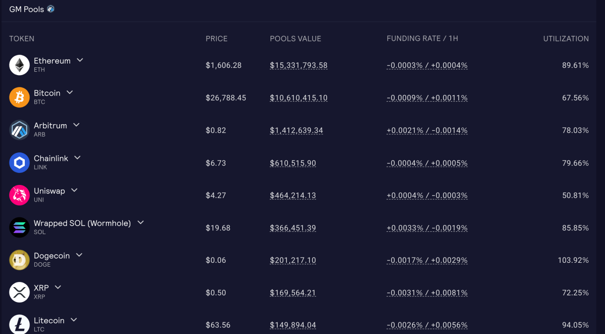
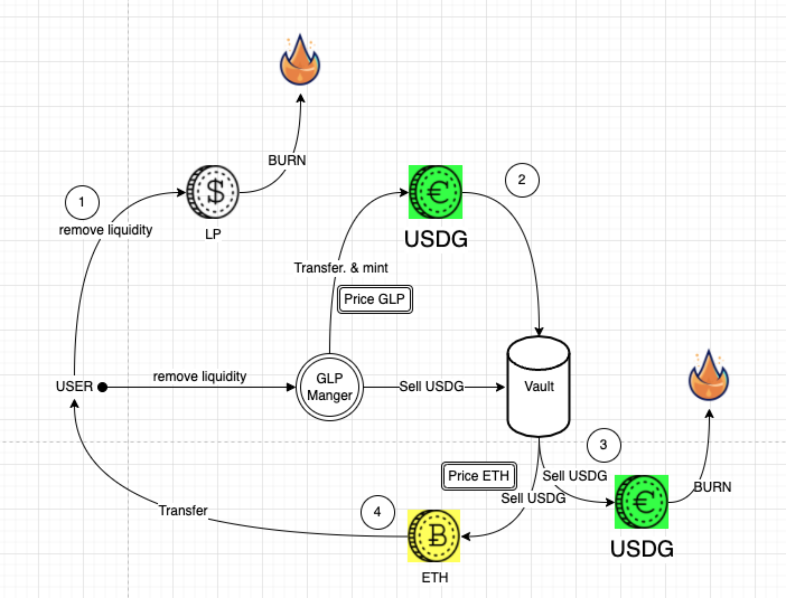

### GLP流动性原理与实现
GMX v1版本GLP是指数形式（一揽子资产）的流动性代币，v2版本代币名称改成了GM。这种流动性代币并不是无价值币，而是由对应比例的资产组成的合成资产。

组成GLP的一揽子代币里并没有自己的代币GMX，而用的是最具有公允价值的几个代币。而且你会发现，作为一般对手方的稳定币和非稳定币的比例几乎是1:1。

GLP是以一揽子不同比例的资产构成的指数性流动代币。代表了整个GMX的AUM（资产净值）和资金池流动性。避免持有者将永远无法对冲风险，GMX会周期性按照目前合约未平仓头寸比例调整各个代币权重。例如很多交易者做多ETH，那么ETH的目标比例就会上升，反之则是稳定币的目标权重上升。


### GLP质押和解除业务逻辑：

GLP是LP代币，需要给每个币定一个目标占比，这样可以根据占比来定一个指数。
GLP 流动性提供者，通过任意一种 token 来购买usdg，然后按照GLP价格购买指数 GLP，从而给 vault 提供流动性。


由mapping PoolAmount来记录vault收到的token数量，mapping UsdgAmount来记录对应的债务，mapping feeReserves记录手续费



### GLP定价
GLP 的价格除了由组成的资产价格決定外，还需考虑 GLP 在与交易员博弈过程中的盈亏情況。
因为 GLP 与交易员是零和博弈，交易员亏损则 GLP 获利，其币价上涨，反之亦然。 

GLP 的铸造和赎回的价格是根据（指数中的资产总价值，包括未平仓头寸的损益）/（GLP 供应量）计算的。


GLP的持有者提供杠杆交易的流动性，赚取70%的资金费率。
GLP的mint,burn,swap价格将根据行为对于资产价格的影响而变动，token权重会根据未平仓合约进行调整，从而对冲GLP持有者的风险，这其中也可能有套利机会，如果ETH被大量做多，其权重就会变高，从而影响GLP和相关资产的价格。

代币权重会根据交易者的未平仓头寸进行调整，以帮助对冲 GLP 持有者。
增加流动性，仓位的执行受到timelock的影响


### 代码解读：

Glp相关合约：	
RewardRouter合约：实现了一个奖励路由器，用于管理和操作GMX和GLP代币的质押、解质押和奖励领取。

GlpBalance合约：实现了一个管理GLP代币余额和授权的智能合约。它提供了一些基本的功能，如查询余额、授权额度和执行转账操作。

GlpManager合约	：合约提供了管理GLP代币流动性的功能，并提供了一些辅助函数来计算资产的净值和价格。

RewardRouterV2合约：实现了一个奖励路由器，用于处理GMX和GLP代币的抵押、取回和奖励分发。

Vault合约：GLP是平台的流动性提供者代币，由Vault管理，代表流动性提供。

StakedGlp合约：实现了一个质押GLP代币的转移功能，并与其他奖励追踪器合约进行交互。

StakedGlpMigrator合约：用于迁移已抵押的GLP代币的合约，通过解押和抵押操作，将GLP代币从发送者账户转移到接收者账户。


``` Solidity
// usdgAmounts tracks the amount of USDG debt for each whitelisted token
mapping (address => uint256) public override usdgAmounts;
// poolAmounts tracks the number of received tokens that can be used for leverage
// this is tracked separately from tokenBalances 
// to exclude funds that are deposited as margin collateral
mapping (address => uint256) public override poolAmounts;
// feeReserves tracks the amount of fees per token
mapping (address => uint256) public override feeReserves;

function _addLiquidity(
    address _fundingAccount,  // 资金地址
    address _account, // 接收GLP地址
    address _token,  // 代币地址
    uint256 _amount,  // 数量
    uint256 _minUsdg,  // 滑点保护
    uint256 _minGlp) private returns (uint256) {
        require(_amount > 0, "GlpManager: invalid _amount");

        // 计算当前AUM和GLP供应量
        uint256 aumInUsdg = getAumInUsdg(true);
        uint256 glpSupply = IERC20(glp).totalSupply();

        // 代币转账和记账
        IERC20(_token).safeTransferFrom(_fundingAccount, address(vault), _amount);
        uint256 usdgAmount = vault.buyUSDG(_token, address(this));
        require(usdgAmount >= _minUsdg, "GlpManager: insufficient USDG output");

        // 计算并铸造GLP
        uint256 mintAmount = aumInUsdg == 0 ? usdgAmount : usdgAmount.mul(glpSupply).div(aumInUsdg);
        require(mintAmount >= _minGlp, "GlpManager: insufficient GLP output");

        IMintable(glp).mint(_account, mintAmount);

        // 更新状态
        lastAddedAt[_account] = block.timestamp;

        emit AddLiquidity(_account, _token, _amount, aumInUsdg, glpSupply, usdgAmount, mintAmount);

        return mintAmount;
    } 
```

计算AUM数值

在计算AUM时记入了每个资产的poolAmount和仓位PnL：


``` Solidity

function getAum(
    bool maximise // 最大化
    ) public view returns (uint256) {
        // 拿到vault中支持的所有token列表
        uint256 length = vault.allWhitelistedTokensLength();
        // 设定Aum的初值为aumAddition，该aumAddition值由系统管理员设置
        uint256 aum = aumAddition;
        uint256 shortProfits = 0;
        IVault _vault = vault;

        // 针对whiteList token计算AUM
        for (uint256 i = 0; i < length; i++) {
            address token = vault.allWhitelistedTokens(i);
            bool isWhitelisted = vault.whitelistedTokens(token);

            if (!isWhitelisted) {
                continue;
            }

            // 根据maximise获取token价格，token池的数量
            uint256 price = maximise ? _vault.getMaxPrice(token) : _vault.getMinPrice(token);
            // 拿到该token的poolAmount作为该token的存在数量
            uint256 poolAmount = _vault.poolAmounts(token);
            // 拿到该token的小数位数
            uint256 decimals = _vault.tokenDecimals(token);

            // 针对稳定币的aum算法，aum+=poolAmount*Price
            if (_vault.stableTokens(token)) {
                aum = aum.add(poolAmount.mul(price).div(10 ** decimals));
            } else {
                // 针对非稳定币，考虑系统的在该token上的未实现盈亏，分别考虑多头和空头部分
                uint256 size = _vault.globalShortSizes(token);

                // 如果该空仓头寸大于0，则拿到该空仓头寸的平均价格avgPrice
                // 计算 delta = size * abs(price-avgPrice) / avgPrice
                // 如果当前价格比avgPrice价格高，则用户亏钱，LP赚钱，则 aum+=delta
                // 如果当前价格比avgPrice价格低，则用户赚钱，LP亏钱，则 aum-=delta
                if (size > 0) {
                    (uint256 delta, bool hasProfit) = getGlobalShortDelta(token, price, size);
                    if (!hasProfit) {
                        aum = aum.add(delta);
                    } else {
                        shortProfits = shortProfits.add(delta);
                    }
                }
                
                // 考虑多头部分，aum+=guranteedUsd[token]，即将用户从LP这里借的钱也算作LP的资产
                aum = aum.add(_vault.guaranteedUsd(token));
                // 拿到系统预留下的token数量，reserveAmount
                // 从poolAmount中扣除reserveAmount后，在乘以price得到该token的净价值
                uint256 reservedAmount = _vault.reservedAmounts(token);
                aum = aum.add(poolAmount.sub(reservedAmount).mul(price).div(10 ** decimals));
            }
        }

        // 最后从aum中扣除aumDeduction部分，作为所有token的总价值
        aum = shortProfits > aum ? 0 : aum.sub(shortProfits);
        return aumDeduction > aum ? 0 : aum.sub(aumDeduction);
    }
```


